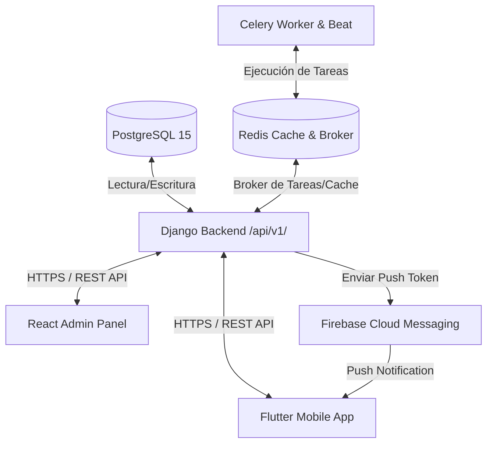

# DOCUMENTO DE DISEÑO ARQUITECTÓNICO: GÉNESIS APP

Este documento define las directrices y decisiones de arquitectura del ecosistema digital **Génesis App**.

---

## 1. Diagrama de Flujo de Datos y Conexión

El backend actúa como la única fuente de verdad. No existe comunicación directa entre las aplicaciones cliente (React y Flutter) y la base de datos PostgreSQL.



---

## 2. Estrategia de Autenticación y Seguridad

La autenticación se implementa con **SimpleJWT** sobre Django REST Framework:
1. **Flujo de Acceso**:
   - El cliente envía credenciales a `POST /api/v1/auth/login/` o mediante Google Token a `POST /api/v1/auth/google/`.
   - El backend responde con un `access_token` (vida útil sugerida: 15 minutos) y un `refresh_token` (vida útil sugerida: 7 días).
2. **Almacenamiento de Tokens**:
   - **Flutter**: Se almacenan estrictamente en **Flutter Secure Storage** (Key-Value cifrado del sistema). Está prohibido usar SharedPreferences para tokens de sesión.
   - **React Admin**: Se almacenan en memoria (Zustand state) y el `refresh_token` puede persistirse de forma segura en cookies `HttpOnly` y `Secure` (si está habilitado SSL/Production) o mediante almacenamiento local si es estrictamente necesario, administrado mediante interceptores.
3. **Renovación (Refresh Token Rotation)**:
   - Los clientes usan interceptores de red (Dio en Flutter, Axios en React) para capturar errores `401 Unauthorized`.
   - Al detectar un 401, el cliente solicita un nuevo `access_token` enviando el `refresh_token` a `POST /api/v1/auth/token/refresh/`.
   - Si la renovación es exitosa, se repite la petición original de forma transparente. Si falla, el cliente limpia la sesión y redirige al Login.

---

## 3. Matriz de Roles y Permisos

El sistema utiliza un control de acceso basado en roles y permisos (RBAC) detallados por módulo y acción.

### Roles Iniciales
- **SUPERADMIN**: Control total del sistema y base de datos.
- **ADMIN**: Administración general de contenidos, usuarios y solicitudes de la iglesia.
- **CONTENT_EDITOR**: Edición y publicación de devocionales, noticias y servicios.
- **CELL_LEADER**: Gestión de miembros y solicitudes de su célula asignada.
- **SUPPORT**: Gestión de solicitudes de consejería, oración y soporte técnico.
- **MEMBER**: Usuario registrado de la comunidad (puede guardar devocionales, registrarse a eventos, solicitar unirse a células).
- **VIEWER**: Invitado público sin registro (acceso limitado a contenidos públicos).

### Acciones
`VIEW`, `CREATE`, `EDIT`, `PUBLISH`, `DELETE`, `EXPORT`

### Ejemplo de Matriz de Permisos

| Módulo | SUPERADMIN | ADMIN | CONTENT_EDITOR | CELL_LEADER | MEMBER | VIEWER |
|---|:---:|:---:|:---:|:---:|:---:|:---:|
| **Publicaciones** | Full | Full | View, Create, Edit, Publish | View | View | View |
| **Servicios** | Full | Full | View, Create, Edit, Publish | View | View | View |
| **Devocionales** | Full | Full | View, Create, Edit, Publish | View | View | View |
| **Eventos** | Full | Full | View, Create, Edit, Publish | View | View, Register | View |
| **Células** | Full | Full | View | View, Edit (propia) | View, JoinRequest | View |
| **Solicitudes** | Full | Full | None | View (propias) | Create, View (propias) | Create (visita/oración) |
| **Usuarios** | Full | View, Edit, Block | None | None | View (perfil propio) | None |

---

## 4. Estrategia de Variables de Entorno

- **Cero Hardcoding**: Ninguna credencial, llave secreta o URL de API debe estar quemada en el código fuente.
- **Backend (`.env`)**: Administrado mediante la librería `django-environ`. Mantiene llaves de Django, Firebase, Google Client y credenciales de PostgreSQL.
- **Frontend Admin (`.env`)**: Administrado por Vite utilizando el prefijo `VITE_`.
- **Flutter (`--dart-define` o `.env`)**: El host de la API se configura de forma dinámica al compilar para facilitar las pruebas tanto en emuladores como en dispositivos físicos.

---

## 5. Políticas de API

1. **Versionamiento**: Todas las rutas de API públicas e internas deben llevar el prefijo `/api/v1/`.
2. **Paginación**: Formato estandarizado de Django REST Framework para todas las listas extensas:
   ```json
   {
       "count": 120,
       "next": "http://localhost:8000/api/v1/publications/?page=2",
       "previous": null,
       "results": [ ... ]
   }
   ```
3. **Manejo de Errores**: Respuestas de error estandarizadas con códigos de estado HTTP semánticos (ej. `400 Bad Request`, `401 Unauthorized`, `403 Forbidden`, `404 Not Found`).
